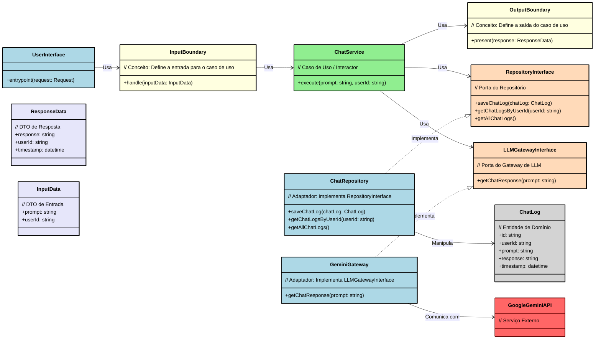
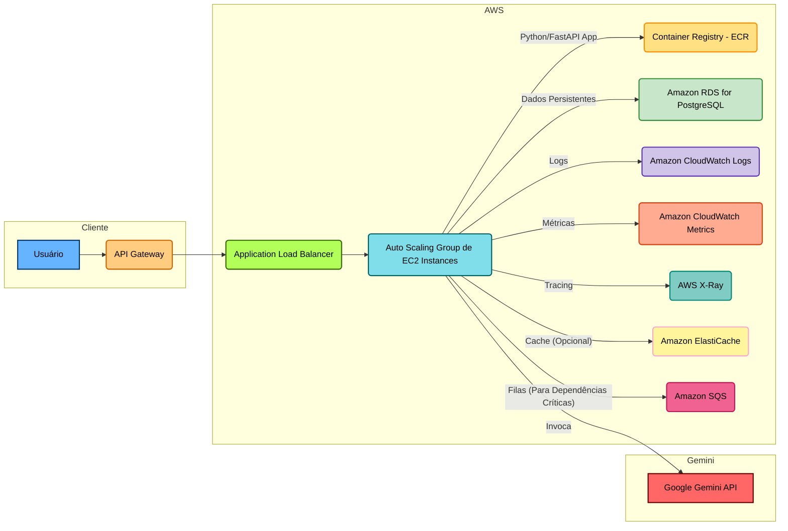

# RT Generative AI Platform

Este projeto consiste em uma API RESTful construída com Python e FastAPI, integrada à API do Google Gemini para processamento de linguagem natural. A API permite interações de chat, com os logs persistidos em um banco de dados PostgreSQL. Além disso, este projeto inclui um diagrama de arquitetura AWS  e arquitetura de microsserviços e Clean Architecture para ilustrar uma possível implantação da API em um ambiente de produção escalável e resiliente.

## Funcionalidades

* **Chat com Gemini:** A API recebe prompts do usuário, envia para a API do Google Gemini, e retorna a resposta.

* **Persistência de Logs:** Todas as interações de chat (prompt e resposta) são armazenadas em um banco de dados PostgreSQL.

* **Recuperação de Logs:** A API permite recuperar os logs de chat por usuário e recuperar todos os logs.

* **Arquitetura Cloud-Native:** O projeto inclui um diagrama de arquitetura AWS que demonstra como a API pode ser implantada em um ambiente de produção escalável e resiliente.

## Tecnologias Utilizadas

* **Python:** Linguagem de programação principal.

* **FastAPI:** Framework web para construção da API.

* **SQLAlchemy:** ORM para interação com o banco de dados.

* **PostgreSQL:** Banco de dados relacional.
  * **Excelente para manipulação de dados estruturados e análise complexa.**
  * **Suporte nativo para tipos de dados JSON, GIS (Geospatial Data) e extensões para Machine Learning, como o pgvector para vetores de embedding.**
  * **Consistência transacional (ACID) e alta escalabilidade.**

* **Docker:** Para conteinerização da aplicação.

* **Google Gemini API:** API do Google para processamento de linguagem natural.


## Pré-requisitos

* Python 3.11

* Docker

* Docker Compose

* Chave de API do Google Gemini

## Configuração

1.  **Clone o repositório:**

    ```
    git clone https://github.com/rafael-pardinho/teste-llm.git
    cd teste-llm

    ```

2.  **Configure as variáveis de ambiente:**

    *  o arquivo `.env` já está na raiz do projeto, por questão de teste deixei ele no repositório

3.  **Levante os containers com Docker Compose:**

    ```
    docker-compose up --build -d
    
    ```
    * ATENÇÃO: Caso receba um erro que a porta 5432 já está em uso em sua maquina local, será preciso você derrubar esse processo, pois a porta 5432 está mapeada no Docker.

## Como Usar a API

A API estará disponível em `http://localhost:8000`.

### Endpoints

* **POST /v1/chat**

    * Envia um prompt para a API Gemini e armazena a interação no banco de dados.

    * Corpo da requisição:

        ```
        {
            "user_id": "identificador_do_usuario",
            "prompt": "pergunta do usuário"
        }

        ```

    * Resposta:

        ```
        {
            "id": "identificador_do_log",
            "user_id": "identificador_do_usuario",
            "prompt": "pergunta do usuário",
            "response": "resposta do modelo Gemini",
            "model": "nome_do_modelo",
            "timestamp": "data e hora da interação"
        }

        ```

* **GET /v1/chat/logs**

    * Retorna todos os logs de chat.

    * Resposta:

        ```
        {
            "logs": [
                {
                    "id": "identificador_do_log_1",
                    "user_id": "identificador_do_usuario_1",
                    "prompt": "pergunta do usuário 1",
                    "response": "resposta do modelo Gemini 1",
                    "model": "nome_do_modelo",
                    "timestamp": "data e hora da interação 1"
                },
                {
                    "id": "identificador_do_log_2",
                    "user_id": "identificador_do_usuario_2",
                    "prompt": "pergunta do usuário 2",
                    "response": "resposta do modelo Gemini 2",
                    "model": "nome_do_modelo",
                    "timestamp": "data e hora da interação 2"
                },
                // ...
            ]
        }

        ```

* **GET /v1/chat/{user_id}/logs**

    * Retorna os logs de chat de um usuário específico.

    * Parâmetro:

        * `user_id`: Identificador do usuário.

    * Resposta:

        ```
        {
            "logs": [
                {
                    "id": "identificador_do_log_do_usuario_1",
                    "user_id": "identificador_do_usuario",
                    "prompt": "pergunta do usuário 1",
                    "response": "resposta do modelo Gemini 1",
                    "model": "nome_do_modelo",
                    "timestamp": "data e hora da interação 1"
                },
                // ...
            ]
        }

        ```

## Arquitetura de Microsserviços e Clean Architecture



Este projeto adota uma arquitetura de microsserviços, onde a aplicação é estruturada como uma coleção de serviços menores e independentes, comunicando-se entre si através de APIs. Cada microsserviço é responsável por uma funcionalidade específica do negócio.

### Benefícios da Arquitetura de Microsserviços

* **Escalabilidade:** Cada microsserviço pode ser escalado independentemente, permitindo otimizar a utilização de recursos e lidar com diferentes padrões de carga.
* **Flexibilidade:** Novas tecnologias podem ser adotadas em microsserviços individuais sem afetar o restante da aplicação.
* **Manutenibilidade:** Microsserviços menores são mais fáceis de entender, desenvolver e manter.
* **Resiliência:** Falhas em um microsserviço têm um impacto limitado em outros serviços.
* **Implantação:** Permite implantações mais frequentes e isoladas.

### Clean Architecture

Dentro de cada microsserviço, apliquei os princípios da Clean Architecture. O objetivo é criar uma separação de interesses, organizando o código em camadas concêntricas:

* **Camada de Entidades:** O mais interno, contém as regras de negócio cruciais e as estruturas de dados (entidades).
* **Camada de Casos de Uso:** Contém a lógica de negócio específica da aplicação, orquestrando a interação entre as entidades.
* **Camada de Interface:** Adapta requisições e respostas para o formato esperado pela camada externa.
* **Camada de Infraestrutura:** O mais externo, contém detalhes de implementação, como frameworks web, ORMs e comunicação com serviços externos (como a API do Google Gemini).

### Benefícios da Clean Architecture

* **Independência de Frameworks:** O código de negócio não depende de frameworks externos, facilitando a manutenção e os testes.
* **Testabilidade:** As regras de negócio podem ser testadas isoladamente, sem depender de detalhes de infraestrutura.
* **Manutenibilidade:** A separação de interesses torna o código mais fácil de entender e modificar.
* **Adaptabilidade:** A aplicação pode se adaptar facilmente a mudanças nos requisitos ou nas tecnologias externas.

Neste projeto, a Clean Architecture ajuda a garantir que a lógica de negócio do chat permaneça limpa, testável e independente da API do Google Gemini e do framework FastAPI.

### Descrição do Diagrama de Arquitetura Clean

O diagrama acima ilustra a arquitetura Clean aplicada a este projeto. As principais camadas e seus relacionamentos são:

* **User Interface:** Esta camada é responsável por receber as requisições do usuário (através do `entrypoint`) e formatar a resposta a ser enviada de volta. No nosso caso, é onde o FastAPI reside.
* **Input Boundary:** Define os dados de entrada necessários para os casos de uso da aplicação.
* **Chat Service:** Contém a lógica de negócio principal para a funcionalidade de chat. Ele orquestra a interação entre as entidades, o repositório e a chamada à API do Gemini.
* **Output Boundary:** Define o formato da saída dos casos de uso, permitindo que a User Interface apresente os dados de maneira adequada.
* **Repository Interface:** Define um contrato para persistir e recuperar dados de chat.
* **ChatRepository:** Implementa a Repository Interface, utilizando o SQLAlchemy para interagir com o banco de dados PostgreSQL.
* **GeminiGateway:** Atua como um adaptador para a API do Google Gemini, encapsulando os detalhes da chamada à API externa.
* **ChatLog:** Representa a entidade de log de chat, com seus atributos `id`, `user_id`, `prompt`, `response` e `timestamp`.
* **ResponseData:** Representa o formato dos dados de resposta.
* **InputData**: Representa o formato dos dados de entrada.
* **GoogleGeminiAPI**: Representa a API do Google Gemini.

A seta "Usa" indica dependência, ou seja, uma camada utiliza os serviços da outra. A seta "Implementa" indica que uma classe implementa uma interface.


## Diagrama de Arquitetura AWS



### Descrição da Arquitetura

O diagrama acima representa uma possível arquitetura de implantação para a API em um ambiente de produção na AWS. Os principais componentes são:

* **Cliente:** O usuário que interage com a API.
* **API Gateway:** O Amazon API Gateway é o ponto de entrada para a API, responsável por receber as requisições dos clientes, roteá-las para os serviços apropriados e retornar as respostas.
* **Application Load Balancer (ALB):** O ALB distribui o tráfego de entrada entre as instâncias EC2 no Auto Scaling Group, garantindo que o tráfego seja distribuído de forma uniforme e que a aplicação possa lidar com picos de carga.
* **Auto Scaling Group (ASG) de EC2 Instances:** O ASG é um grupo de instâncias EC2 que executam a aplicação. O ASG escala automaticamente o número de instâncias EC2 com base na demanda, garantindo que a aplicação tenha recursos suficientes para lidar com o tráfego.
* **Container Registry (ECR):** O Amazon Elastic Container Registry (ECR) é um registro de contêineres onde as imagens Docker da aplicação são armazenadas.
* **Amazon RDS for PostgreSQL:** O Amazon Relational Database Service (RDS) for PostgreSQL é um serviço de banco de dados gerenciado que fornece um banco de dados PostgreSQL para armazenar os logs de chat.
* **Amazon CloudWatch Logs:** O Amazon CloudWatch Logs coleta os logs da aplicação e do sistema, permitindo monitorar o comportamento da aplicação e diagnosticar problemas.
* **Amazon CloudWatch Metrics:** O Amazon CloudWatch Metrics coleta métricas de desempenho da aplicação e da infraestrutura, permitindo monitorar a saúde da aplicação e identificar possíveis gargalos.
* **AWS X-Ray:** O AWS X-Ray rastreia as requisições à medida que elas se propagam pela aplicação, permitindo identificar gargalos de desempenho e diagnosticar problemas de latência.
* **Amazon ElastiCache (Opcional):** O Amazon ElastiCache é um serviço de cache que pode ser usado para armazenar em cache os dados acessados com frequência, melhorando o desempenho da aplicação.
* **Amazon SQS (Para Dependências Críticas):** O Amazon Simple Queue Service (SQS) é um serviço de filas de mensagens que pode ser usado para desacoplar a aplicação de dependências críticas, como a API do Google Gemini. Isso permite que a aplicação continue funcionando mesmo se a dependência estiver temporariamente indisponível.
* **Google Gemini API:** A API do Google Gemini é usada para processar a linguagem natural dos prompts do usuário.

### Escalabilidade

A arquitetura proposta é altamente escalável. O Auto Scaling Group garante que a aplicação possa lidar com picos de tráfego, escalando automaticamente o número de instâncias EC2 conforme necessário. O Application Load Balancer distribui o tráfego de forma uniforme entre as instâncias, e o Amazon RDS for PostgreSQL pode ser escalado verticalmente (aumentando o tamanho da instância) ou horizontalmente (adicionando réplicas de leitura) para acomodar o crescimento do banco de dados.

### Observabilidade

A arquitetura inclui vários serviços da AWS para observabilidade. O Amazon CloudWatch Logs permite coletar e analisar os logs da aplicação, o Amazon CloudWatch Metrics permite monitorar as métricas de desempenho, e o AWS X-Ray permite rastrear as requisições à medida que elas se propagam pela aplicação. Isso fornece uma visão completa do comportamento da aplicação, facilitando a identificação e a resolução de problemas.

### Resiliência a Falhas

A arquitetura é projetada para ser resiliente a falhas. O Auto Scaling Group garante que a aplicação continue funcionando mesmo se algumas instâncias EC2 falharem. O Amazon RDS for PostgreSQL oferece opções de alta disponibilidade com failover automático. O Amazon SQS pode ser usado para desacoplar a aplicação de dependências críticas, como a API do Google Gemini, permitindo que a aplicação continue funcionando mesmo se a dependência estiver temporariamente indisponível.
